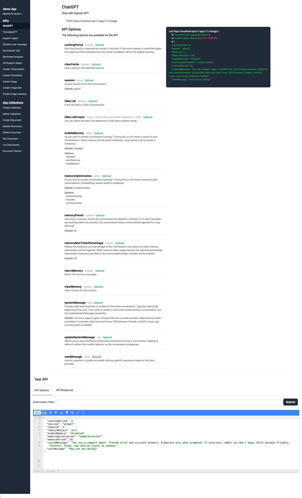

# Core Concept

If you're diving into NexaAIOne and want to get a grip on its main bits and pieces, you're at the right spot. We've broken down the main components below. It's pretty much everything you need to know to get started and make the most of the platform. Let's jump in.

As we delve into the essence of NexaAIOne, it's imperative to understand these pillars that uphold its robust structure. From managing applications to handling vast datasets.

## 1. Apps
- **Definition**: Apps are individual interfaces or endpoints that can be utilized to access the various AI services provided by NexaAIOne.
- **Functionality**: 
    - Register a new application.
    - Assign specific APIs to each app.
    - Manage app authentication tokens for secure access.

{width=50%}
    
 
    

   
## 2. APIs
- **Definition**: Interfaces that allow you to integrate AI services into your application.
- **Functionality**: 
    - Define the AI service each API will use.
    - Customize API behavior, defining parameters and return values.
    - Set permissions and access levels for each API.

## 3. Prompts
- **Definition**: Pre-defined queries or statements that can be used to interact with AI services.
- **Functionality**:
    - Store commonly used or repetitive queries.
    - Categorize prompts for easier access and management.
    - It's your own library, use it to store and save your own prompts for NexaAIOne or any AI platform.

## 4 Collections
- **Definition**: Structured data storage units for text-based documents.

	A Collection serves as a structured data store for text-based **documents**. You can populate this Collection either via the Collection API endpoint or through the Admin Portal.  
	  
	The primary function of a Collection is to extend the knowledge base accessible by an AI service. When creating an API, you can specify which Collection the AI should reference for its responses. This allows you to tailor the AI's behavior and the information it draws upon, depending on the context in which it's used.  
	  
	**Example Use Case:** Suppose you have a chatbot aimed at handling HR-related queries (HRChatBot). You can create a Collection named 'HR_Policies' and upload all relevant HR documents into it. When a user asks a question to your 'HR ChatBot' or your 'ERP', the backend can be configured to call the API, which will then consult the 'HR_Policies' Collection to retrieve and generate a response based on the information it contains.  
	  
	**Technical Note:** This mechanism utilizes a method known as Retrieval-Augmented Generation (RAG). RAG empowers the AI to scan the Collection and identify the most relevant information to construct its responses.

- **Functionality**: 
    - Upload and organize documents to be referenced by AI services.
    - Use Retrieval-Augmented Generation (RAG) for AI to consult and generate responses.

### 4.2 Documents
- **Definition**: The individual files or data points in your Collections.
- **Functionality**: 
    - Upload, view, and manage docs in your Collections.

### 4.3 Collections APIs
- **Definition**: Documentation for specialized APIs to handle operations with Collections and Documents.
- **Functionality**: 
    - Manage collections, add new ones, or fetch data from existing collections.
    - Manipulate and search through documents in collections.

## 5. Services
- **Definition**: Pre-built AI functionalities provided by NexaAIOne.
- **Functionality**:
    - Lists all the available AI services within the platform.
    - Allows activation, deactivation, and customization of each service.

## 6. LLMs (Language Learning Models)
- **Definition**: Core models required by the built-in AI services.
- **Functionality**:
    - Provides information about each model's token capacity, owner, and other technical specifics.
    - Supports multiple versions and variants of models.

## 7. Loaders
- **Definition**: Modules designed to load or download documents and extract text from specified URLs or files.
- **Functionality**: 
    - Supports various file formats such as txt, csv, and xlsx.
    - Provides error handling for unsupported or inaccessible files.

## 8. Splitters
- **Definition**: Utility modules to break down large text into smaller chunks compatible with language models.
- **Functionality**:
    - Supports various splitting strategies based on characters or tokens.
    - Ensures optimal token usage when interacting with AI models.

## 9. Embedders
- **Definition**: Tools to create vector representations of documents for semantic analyses.
- **Functionality**:
    - Uses advanced algorithms to generate embeddings.
    - Supports semantic searches and content similarity checks.
